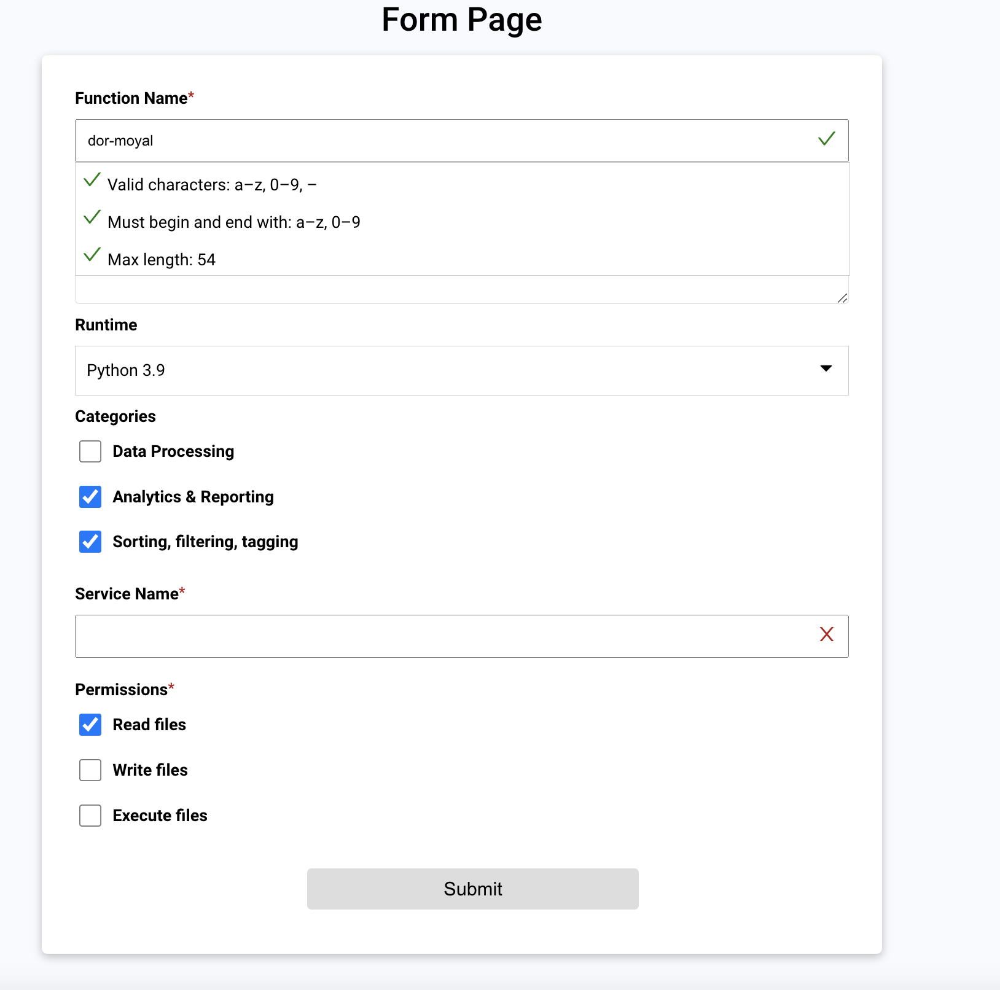

# Form Assignment

## Overview

I've built a custom form using ReactJS. One unique feature of this implementation is the use of a JSON file to structure and configure the form inputs dynamically. This provides greater flexibility and reusability for the form components.

## JSON Structure for Form Inputs

Each form input is represented as a JSON object with the following properties:

- `name`: Acts as the input key and helps in uniquely identifying each form control.
- `label`: The display label for the form control.
- `type`: Specifies the type of the input (e.g., text, number, email, etc.).
- `elementType`: Used to select the component type from the `FormBox` Component (e.g., text box, dropdown, etc.).
- `validation`: An object containing HTML input validation rules, such as:
    - `required`: A boolean indicating if the field is required.
    - `minLength`: The minimum length for the input.
- `initValue`: The initial value for the form control.
- `isRequired`: A boolean to check if the input is a required field.
- `classes`: An object or array used to apply custom CSS classes for styling the form control.

## Example JSON Configuration

```json
{
    "name": "multiCheckBoxSelect",
    "label": "Multi Check Box",
    "elementType": "multiCheckbox",
    "options":  [
      { "label": "United States (US)", "value": "usa" },
      { "label": "United Kingdom (UK)", "value": "uk" },
      { "label": "Central African Republic (CAR)", "value": "car" },
      { "label": "United Arab Emirates (UAE)", "value": "uae" }
    ],
    "initValue": ["uk", "car"],
    "isRequired": true,
    "classes": "flex-100 margin-bottom-10px layout-align-start-start"
}
```

## Features and Implementation

1. **Dynamic Form Creation**: The form is generated dynamically based on the JSON configuration, making it highly reusable and maintainable.
2. **Custom Validation**: Built-in validation logic based on the JSON configuration ensures that the form is correctly filled out.
3. **Styling Flexibility**: Custom CSS classes can be applied for unique styling of each form control.

The JSON-based form configuration allows for a more structured and manageable form creation process. This implementation provides high reusability and flexibility in form design.

## Project Structure

```
root/
|-- src/
|   |-- Components/
|   |   |-- CustomSelect
|   |   |   |-- CustomSelect.css
|   |   |   |-- CustomSelect.js
|   |   |-- FormBox
|   |   |   |-- FormBox.js
|   |   |-- FormComponents
|   |   |   |-- CheckBoxComponent.js
|   |   |   |-- InputComponent.js
|   |   |   |-- RadioComponent.js
|   |   |-- FormContainer
|   |   |   |-- FormContainer.js
|   |   |-- ValidTextBox
|   |   |   |-- ValidTextBox.css
|   |   |   |-- ValidTextBox.js
|   |   |-- MultipleCheckboxes
|   |   |   |-- MultipleCheckboxes.js
|   |-- utils/
|   |   |-- formStructure
|   |   |-- validationArrays
|   |-- App.js
|   |-- index.js
|-- package.json
|-- README.md
```

## How to Run

1. Clone the repository.
2. Navigate to the project folder.
3. Run `npm install` to install the dependencies.
4. Run `npm start` to start the application.

